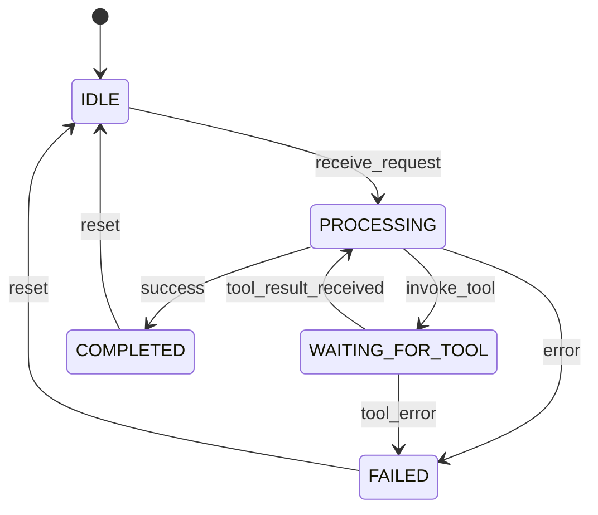

# Agent State Machine

The Agent in Onion Core follows a well-defined state machine that governs its lifecycle and behavior during execution.

## States

### IDLE
The initial state where the agent is ready to receive requests.

### PROCESSING
The agent is actively processing a request through the pipeline.

### WAITING_FOR_TOOL
The agent has invoked a tool and is waiting for the result.

### COMPLETED
The agent has successfully completed the request.

### FAILED
The agent encountered an error and failed to complete the request.

## State Transitions

## Implementation Details

The state machine is implemented in the `AgentRuntime` class and ensures:

1. **Thread Safety**: State transitions are atomic and thread-safe
2. **Consistency**: Invalid transitions are rejected
3. **Observability**: State changes are logged and traced
4. **Recovery**: Failed states can be reset for retry

## Best Practices

- Always check agent state before submitting new requests
- Monitor state transitions for debugging
- Implement proper error handling for FAILED states
- Use circuit breakers to prevent cascading failures

## Related

- [Pipeline Scheduling](pipeline-scheduling.md)
- [Error Code System](error-code-system.md)
- [Distributed Consistency](distributed-consistency.md)
