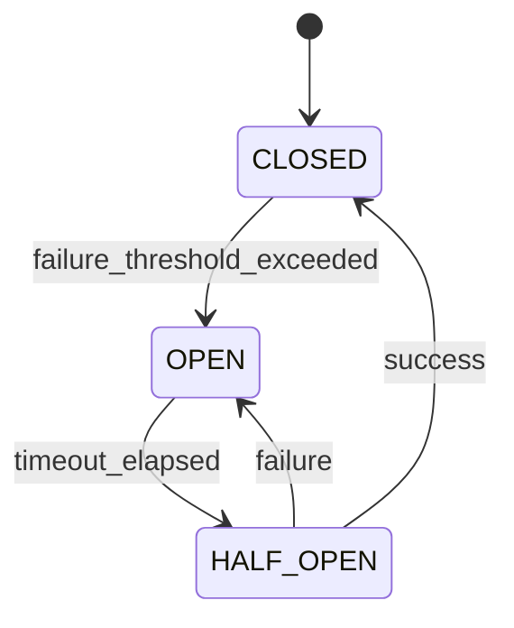

# Circuit Breaker Transitions

The circuit breaker pattern prevents cascading failures by monitoring provider health and automatically switching to fallbacks when needed.

## States

### CLOSED (Normal Operation)

- All requests pass through normally
- Failure count is tracked
- System is healthy

**Transition**: CLOSED → OPEN when failure threshold is exceeded

### OPEN (Failure State)

- All requests are immediately rejected
- No calls to the failing provider
- A timeout timer starts

**Transition**: OPEN → HALF_OPEN after timeout period

### HALF_OPEN (Testing State)

- Limited test requests are allowed
- Monitors if the provider has recovered
- Success rate determines next state

**Transitions**:
- HALF_OPEN → CLOSED: If test requests succeed
- HALF_OPEN → OPEN: If test requests fail

## State Diagram



## Configuration

```python
from onion_core import CircuitBreakerMiddleware

circuit_breaker = CircuitBreakerMiddleware(
    failure_threshold=5,      # Number of failures before opening
    recovery_timeout=60,      # Seconds before trying again
    half_open_max_calls=3,    # Test calls in half-open state
    success_threshold=2       # Successes needed to close
)
```

## Implementation Details

### Failure Tracking

Failures are tracked within a sliding window:

```python
class CircuitBreaker:
    def __init__(self, failure_threshold=5, window_size=60):
        self.failure_threshold = failure_threshold
        self.window_size = window_size
        self.failures = []
    
    def record_failure(self):
        now = time.time()
        self.failures.append(now)
        self._cleanup_old_failures(now)
    
    def _cleanup_old_failures(self, now):
        cutoff = now - self.window_size
        self.failures = [t for t in self.failures if t > cutoff]
    
    def should_trip(self):
        return len(self.failures) >= self.failure_threshold
```

### Timeout Management

The recovery timeout determines how long the circuit stays open:

```python
import asyncio

async def check_recovery(self):
    if self.state == CircuitState.OPEN:
        if time.time() - self.last_failure_time > self.recovery_timeout:
            self.state = CircuitState.HALF_OPEN
            logger.info("Circuit breaker transitioning to HALF_OPEN")
```

### Half-Open Testing

In half-open state, only a limited number of test requests are allowed:

```python
async def execute_with_circuit_breaker(self, request):
    if self.state == CircuitState.HALF_OPEN:
        if self.half_open_calls >= self.half_open_max_calls:
            raise CircuitBreakerOpenError("Too many half-open calls")
        self.half_open_calls += 1
    
    try:
        result = await self.provider.execute(request)
        self.on_success()
        return result
    except Exception as e:
        self.on_failure()
        raise
```

## Monitoring and Observability

### Metrics to Track

1. **State Changes**: Monitor transitions between states
2. **Failure Rate**: Track failure percentage over time
3. **Recovery Time**: Measure time from OPEN to CLOSED
4. **Rejected Requests**: Count requests blocked by open circuit

### Logging

```python
import logging

logger = logging.getLogger(__name__)

def on_state_change(self, old_state, new_state):
    logger.info(
        f"Circuit breaker state changed: {old_state} → {new_state}",
        extra={
            "circuit_breaker": self.name,
            "old_state": old_state.value,
            "new_state": new_state.value,
            "timestamp": time.time()
        }
    )
```

## Best Practices

### 1. Set Appropriate Thresholds

- **Failure Threshold**: Start with 5-10 failures
- **Recovery Timeout**: Start with 30-60 seconds
- **Adjust Based On**: Provider reliability and SLA requirements

### 2. Implement Graceful Degradation

```python
try:
    response = await primary_provider.execute(request)
except CircuitBreakerOpenError:
    response = await fallback_provider.execute(request)
```

### 3. Monitor and Alert

Set up alerts for:
- Frequent state changes
- Long periods in OPEN state
- High rejection rates

### 4. Test Circuit Breaker Behavior

```python
async def test_circuit_breaker():
    # Simulate failures
    for i in range(10):
        try:
            await provider.execute(failing_request)
        except Exception:
            pass
    
    # Verify circuit is open
    assert circuit_breaker.state == CircuitState.OPEN
    
    # Wait for recovery timeout
    await asyncio.sleep(recovery_timeout)
    
    # Verify circuit is half-open
    assert circuit_breaker.state == CircuitState.HALF_OPEN
```

## Distributed Circuit Breaking

For distributed systems, use `DistributedCircuitBreakerMiddleware`:

```python
from onion_core.middlewares import DistributedCircuitBreakerMiddleware

distributed_cb = DistributedCircuitBreakerMiddleware(
    redis_url="redis://localhost:6379",
    failure_threshold=5,
    recovery_timeout=60
)
```

This ensures circuit state is shared across multiple instances.

## Troubleshooting

### Circuit Opens Too Frequently

**Symptoms**: Service frequently unavailable

**Solutions**:
1. Increase failure threshold
2. Check provider health
3. Implement better error classification
4. Add retry logic with backoff

### Circuit Doesn't Open When Expected

**Symptoms**: Failures continue without protection

**Solutions**:
1. Verify failure detection logic
2. Check error type classification
3. Ensure proper exception handling
4. Review sliding window configuration

### Slow Recovery

**Symptoms**: Long time to return to normal operation

**Solutions**:
1. Reduce recovery timeout
2. Decrease success threshold
3. Improve half-open testing strategy
4. Consider manual reset option

## Related Topics

- [Error Code System](error-code-system.md)
- [Setup Fallback Providers](../how-to-guides/setup-fallback-providers.md)
- [Troubleshoot Timeouts](../how-to-guides/troubleshoot-timeouts.md)
