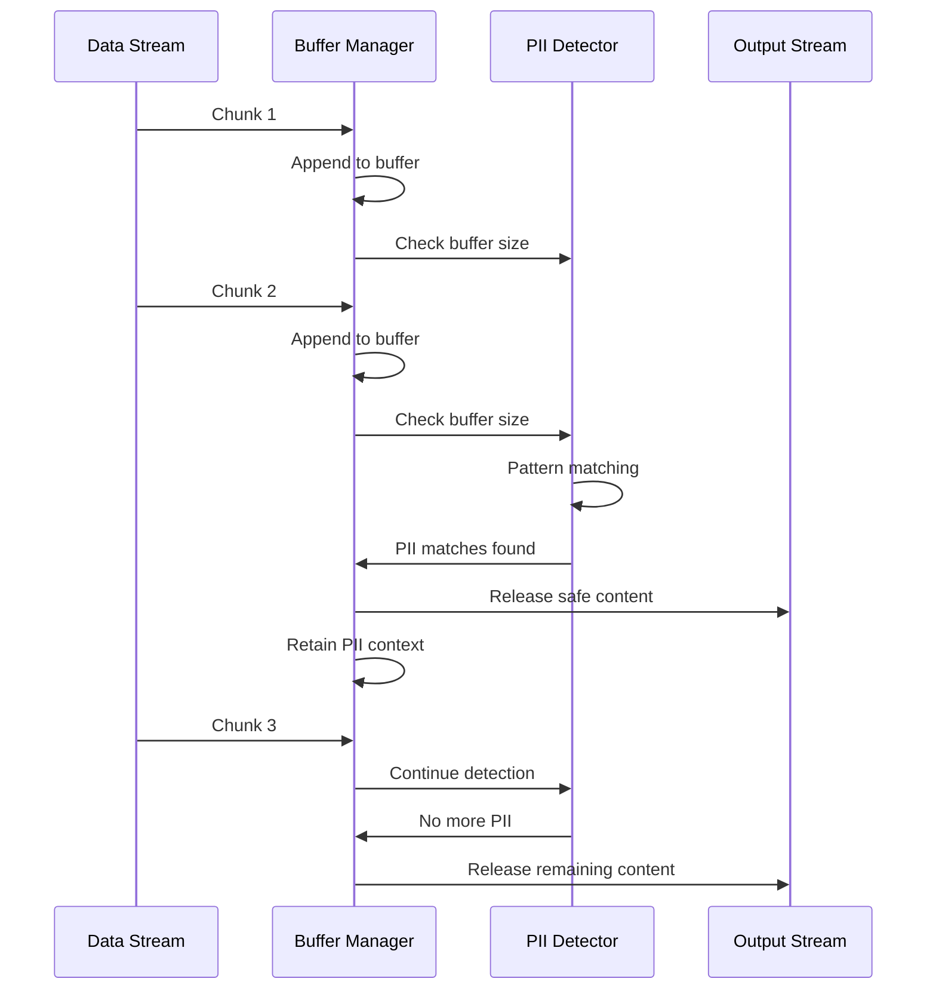

# Streaming PII Algorithm

The streaming PII (Personally Identifiable Information) detection algorithm processes text in chunks while maintaining accuracy and minimizing latency.

## The Challenge

Traditional PII detection works on complete text, but streaming responses require:

1. **Real-time Processing**: Detect PII as data arrives
2. **Buffer Management**: Handle partial tokens
3. **Context Awareness**: Maintain detection accuracy across chunks
4. **Low Latency**: Minimize impact on response time

## Algorithm Overview

### Phase 1: Buffering

Incoming chunks are buffered until we have enough context:

```python
class StreamingPIIDetector:
    def __init__(self, buffer_size=100):
        self.buffer = ""
        self.buffer_size = buffer_size
        self.pending_chunks = []
    
    def add_chunk(self, chunk: str):
        self.buffer += chunk
        self.pending_chunks.append(chunk)
        
        if len(self.buffer) >= self.buffer_size:
            return self.process_buffer()
        return None
```

### Phase 2: Pattern Matching

Apply regex patterns to the buffered content:

```python
import re

PII_PATTERNS = {
    'email': r'\b[A-Za-z0-9._%+-]+@[A-Za-z0-9.-]+\.[A-Z|a-z]{2,}\b',
    'phone': r'\b\d{3}[-.]?\d{3}[-.]?\d{4}\b',
    'ssn': r'\b\d{3}-\d{2}-\d{4}\b',
    'credit_card': r'\b\d{4}[- ]?\d{4}[- ]?\d{4}[- ]?\d{4}\b',
}

def detect_pii(self, text: str) -> List[PIIMatch]:
    matches = []
    for pii_type, pattern in PII_PATTERNS.items():
        for match in re.finditer(pattern, text):
            matches.append(PIIMatch(
                type=pii_type,
                start=match.start(),
                end=match.end(),
                value=match.group()
            ))
    return matches
```

### Phase 3: Safe Release

Release safe portions of the buffer while retaining potentially sensitive content:

```python
def release_safe_content(self, pii_matches: List[PIIMatch]) -> str:
    if not pii_matches:
        # No PII detected, release all buffered content
        safe_content = self.buffer
        self.buffer = ""
        return safe_content
    
    # Find the last safe position
    first_pii_start = min(match.start for match in pii_matches)
    
    # Release content before the first PII
    safe_content = self.buffer[:first_pii_start]
    self.buffer = self.buffer[first_pii_start:]
    
    return safe_content
```

### Phase 4: Redaction

Replace detected PII with placeholders:

```python
def redact_pii(self, text: str, pii_matches: List[PIIMatch]) -> str:
    result = text
    # Process matches in reverse order to maintain positions
    for match in sorted(pii_matches, key=lambda m: m.start, reverse=True):
        replacement = f"[{match.type.upper()}]"
        result = result[:match.start] + replacement + result[match.end:]
    return result
```

## Complete Flow



## Optimization Techniques

### 1. Incremental Matching

Instead of re-scanning the entire buffer, only scan new content:

```python
def incremental_scan(self, new_content: str):
    # Only scan the new portion plus overlap
    scan_start = max(0, len(self.buffer) - OVERLAP_SIZE)
    scan_text = self.buffer[scan_start:] + new_content
    return self.detect_pii(scan_text)
```

### 2. Pattern Compilation

Pre-compile regex patterns for better performance:

```python
COMPILED_PATTERNS = {
    pii_type: re.compile(pattern)
    for pii_type, pattern in PII_PATTERNS.items()
}
```

### 3. Batch Processing

Process multiple chunks together when possible:

```python
async def process_batch(self, chunks: List[str]):
    combined = "".join(chunks)
    matches = self.detect_pii(combined)
    return self.redact_pii(combined, matches)
```

## Edge Cases

### Partial Token Detection

When PII spans multiple chunks:

```python
# Example: "john.doe@" in chunk 1, "example.com" in chunk 2
# Solution: Maintain overlap buffer
OVERLAP_SIZE = 50  # Keep last 50 chars for context
```

### False Positives

Minimize false positives with context-aware rules:

```python
def is_likely_pii(self, match: PIIMatch, context: str) -> bool:
    # Check surrounding context
    before = context[max(0, match.start-20):match.start]
    after = context[match.end:min(len(context), match.end+20)]
    
    # Email after "contact:" is likely PII
    if match.type == 'email' and 'contact:' in before.lower():
        return True
    
    # Numbers in URLs are not phone numbers
    if match.type == 'phone' and 'http' in before:
        return False
    
    return True
```

### Performance vs. Accuracy Tradeoff

| Buffer Size | Latency | Accuracy | Memory |
|-------------|---------|----------|--------|
| 50 chars | Low | Medium | Low |
| 100 chars | Medium | High | Medium |
| 200 chars | High | Very High | High |

## Configuration

```python
from onion_core.middlewares import SafetyMiddleware

safety = SafetyMiddleware(
    pii_detection=True,
    streaming_buffer_size=100,
    pii_patterns={
        'email': r'\b[A-Za-z0-9._%+-]+@[A-Za-z0-9.-]+\.[A-Z|a-z]{2,}\b',
        'phone': r'\b\d{3}[-.]?\d{3}[-.]?\d{4}\b',
    },
    redaction_placeholder="[REDACTED]"
)
```

## Testing

```python
async def test_streaming_pii():
    detector = StreamingPIIDetector(buffer_size=50)
    
    # Test email detection across chunks
    chunk1 = "Contact me at john."
    chunk2 = "doe@example.com for details"
    
    detector.add_chunk(chunk1)
    result = detector.add_chunk(chunk2)
    
    assert "[EMAIL]" in result
    assert "john.doe@example.com" not in result
```

## Best Practices

1. **Tune Buffer Size**: Balance latency and accuracy
2. **Monitor Performance**: Track detection time per chunk
3. **Update Patterns**: Regularly update PII patterns
4. **Test Edge Cases**: Verify behavior with partial tokens
5. **Log Detections**: Track PII detection for auditing

## Related Topics

- [Customize PII Rules](../how-to-guides/custom-pii-rules.md)
- [Secure Agent Tutorial](../tutorials/02-secure-agent.md)
